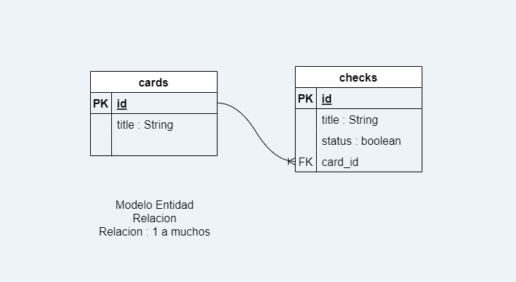

## APP LIST CHECK
## Backend: Laravel , MySql, Api Rest
## Frontend: Vue js 3, Bootstrap, Axios





## API Reference

#### Post Register Card

```http
  POST api/cards
```

| Body | Type     | Description                |
| :-------- | :------- | :------------------------- |
| `title` | `string` | **Required**. Title card |

#### Response

```
{
    "title": "musica",
    "status": "0",
    "updated_at": "2023-09-01T14:57:43.000000Z",
    "created_at": "2023-09-01T14:57:43.000000Z",
    "id": 41
}
```

### UPDATE card
```http
    PUT api/cards/{id}
```

| Body | Type     | Description                |
| :-------- | :------- | :------------------------- |
| `id` | `number` | **Required**. id card, param route |
| `title` | `string` | **Required**. Title card |


### DELETE card
```http
    DELETE api/cards/{id}
```
| Body | Type     | Description                |
| :-------- | :------- | :------------------------- |
| `id` | `number` | **Required**. id card, param route |


#### GET all cards and items
```http
    GET api/cards
```

#### Response

```
[
    {
        "id": 39,
        "title": "Supermercado",
        "check": [
            {
                "id": 67,
                "title": "pollo",
                "status": 1,
                "card_id": 39,
                "created_at": "2023-02-22T11:06:07.000000Z",
                "updated_at": "2023-02-22T11:14:01.000000Z"
            },
            {
                "id": 68,
                "title": "salsa",
                "status": 1,
                "card_id": 39,
                "created_at": "2023-02-22T11:06:10.000000Z",
                "updated_at": "2023-02-22T11:14:02.000000Z"
            },
            .
            .
            .
        ]
    },
    {
        "id": 40,
        "title": "torta",
        "check": [
            {
                "id": 71,
                "title": "huevos",
                "status": 1,
                "card_id": 40,
                "created_at": "2023-02-22T11:06:31.000000Z",
                "updated_at": "2023-02-22T11:13:55.000000Z"
            },
            {
                "id": 72,
                "title": "harina",
                "status": 1,
                "card_id": 40,
                "created_at": "2023-02-22T11:06:34.000000Z",
                "updated_at": "2023-02-22T11:13:57.000000Z"
            },
            .
            .
            .
        ]
    }
]
```

#### GET card
```http
    GET api/car/{id}
```
| Body | Type     | Description                |
| :-------- | :------- | :------------------------- |
| `id` | `number` | **Required**. id card, param route |

#### Response

```
{
    "id": 39,
    "title": "Supermercado",
    "created_at": "2023-02-22T11:06:02.000000Z",
    "updated_at": "2023-02-22T11:06:02.000000Z",
    "status": 0,
    "check": [
        {
            "id": 67,
            "title": "pollo",
            "status": 1,
            "card_id": 39,
            "created_at": "2023-02-22T11:06:07.000000Z",
            "updated_at": "2023-02-22T11:14:01.000000Z"
        },
        {
            "id": 68,
            "title": "salsa",
            "status": 1,
            "card_id": 39,
            "created_at": "2023-02-22T11:06:10.000000Z",
            "updated_at": "2023-02-22T11:14:02.000000Z"
        },
        .
        .
        .
    ]
}
```

#### GET items all
```http
    GET api/checks
```

#### Response

```
[
    {
        "id": 67,
        "title": "pollo",
        "status": 1,
        "card_id": 39,
        "created_at": "2023-02-22T11:06:07.000000Z",
        "updated_at": "2023-02-22T11:14:01.000000Z"
    },
    {
        "id": 68,
        "title": "salsa",
        "status": 1,
        "card_id": 39,
        "created_at": "2023-02-22T11:06:10.000000Z",
        "updated_at": "2023-02-22T11:14:02.000000Z"
    },
    .
    .
    .
]
```
#### POST item register
```http
    POST api/checks
```
| Body | Type     | Description                |
| :-------- | :------- | :------------------------- |
| `title` | `number` | **Required**. title item |
| `status` | `boolean` | **Required**. status item |
| `card_id` | `number` | **Required**. id card, foreing key |

#### Response

```
{
    "title": "tareas mate",
    "status": "1",
    "card_id": "39",
    "updated_at": "2023-09-01T20:58:55.000000Z",
    "created_at": "2023-09-01T20:58:55.000000Z",
    "id": 76
}
```

#### UPDATE item 

```http
    PUT api/checks/{id}
```
| Body | Type     | Description                |
| :-------- | :------- | :------------------------- |
| `id` | `number` | **Required**. id item, param route |
| `title` | `string` | **Required**. title item |
| `status` | `boolean` | **Required**.  |

#### Body

```
{
    "title":"tarea matematicas",
    "status":1
}
```

#### Response

```
{
    "id": 76,
    "title": "tarea matematicas",
    "status": 1,
    "card_id": 39,
    "created_at": "2023-09-01T20:58:55.000000Z",
    "updated_at": "2023-09-01T21:06:12.000000Z"
}
```
#### DELETE item 
```http
    DELETE api/checks/{id}
```
| Body | Type     | Description                |
| :-------- | :------- | :------------------------- |
| `id` | `number` | **Required**. id item, param route |

